<p align="center">
  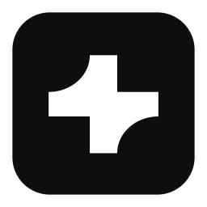
</p>
<h1 align="center">Clasp Studio</h1>
<p align="center">Your camera. Your script. Your show.</p>
<p align="center">
  <strong>Native macOS broadcast studio</strong><br>
  macOS 14+ · Apple silicon & Intel · SwiftUI · AVFoundation
</p>
<p align="center">
  <a href="https://github.com/deanayoung3-droid/clasp-studio/releases/latest">Download the app</a> ·
  <a href="#your-first-recording">Get started</a> ·
  <a href="#updates-from-github">GitHub updates</a> ·
  <a href="docs/USER_GUIDE.md">Full guide</a>
</p>

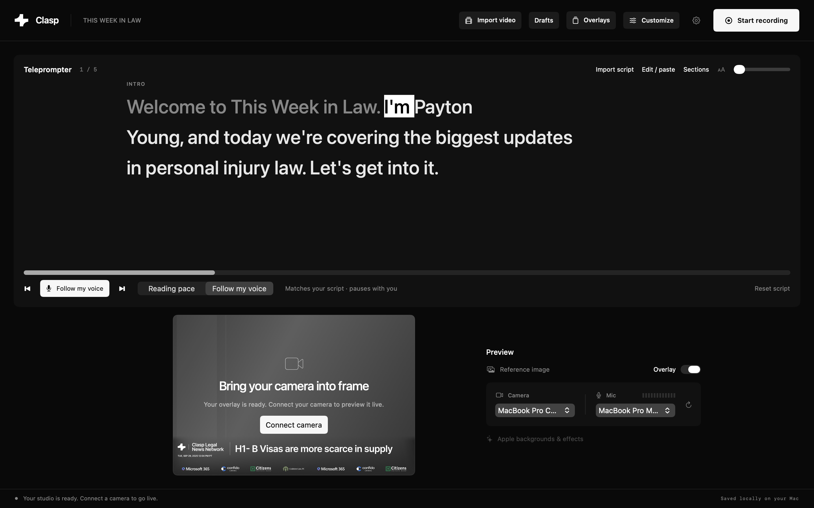

Clasp Studio combines a live camera, your selected microphone, a script-following teleprompter, and editable broadcast graphics in one Mac app. Start recording to focus on the preview and your script. Stop to edit your take on a timeline, then export and jump directly to the finished movie in Finder.

## Built for a complete take

| Feature | What you can do |
| --- | --- |
| Live capture | Select a built-in, external, or available Continuity Camera, with an independent microphone. |
| Teleprompter | Import or paste a script, use on-device English voice following, or choose timed reading pace. |
| Overlay library | Switch between six supplied designs, import your own SVG artwork, and preserve each design’s edits. |
| Component editor | Select regions on the canvas; edit each component within the design’s protected layout rules. |
| Branding | Change titles, episode dates, presenter text, headline cards, colors, program logos, and brand logos. |
| Sponsor carousel | Edit up to twelve names and logos, reorder or hide sponsors, and set continuous scroll speed. |
| LIVE indicator | Customize the label and color, and enable a smooth pulse. Motion respects Reduce Motion. |
| Apple video effects | Use macOS Background, Portrait and Studio Light where supported by your camera and Mac. |
| Recording | Capture a clean camera-and-microphone draft, then edit before the final MP4 export. |
| Timeline editor | Trim, split, remove and reorder clips; undo and redo edits without changing source footage. |
| Imported footage | Bring in Zoom recordings and other MOV/MP4 videos, then add broadcast graphics. |
| Picture layouts | Replace the camera with an image or video, create a split screen, and remove the topics sidebar per clip. |
| Reference images | Show a captioned image card on air; change its side, size and visibility live or on the timeline. |
| Animation library | Import reusable MOV/MP4 stingers with audio, or choose a native news wipe and fade through black. |
| Saved-file popup | Choose **Show in Finder** to open the recording folder and select the finished file. |
| GitHub updates | Receive verified releases generated automatically by pushes to `main`. |

## Import your own SVG

Choose **Overlays → Import SVG**, or **Import SVG overlay…** in the video editor. The file becomes a reusable design immediately, preserving its shapes, outlined lettering, logos and transparent gradients. Its large embedded photos are replaced by the camera by default; smaller logos stay in the artwork.

SVG artwork keeps its original proportions. **Fit** shows the entire design; **Fill** crops the edges to cover 16:9. Neither stretches the artwork. Previously saved SVG imports are corrected automatically.

**Crop video to SVG canvas** is enabled by default for imported Fit designs. The preview and exported file use the SVG’s proportions, removing the surrounding side space without filling it or stretching the artwork. Camera openings retain their original bounds. Output dimensions are rounded to even pixels for H.264; the clean camera take remains available for editing. Turn this option off to keep a 16:9 canvas.

## Reference images on air

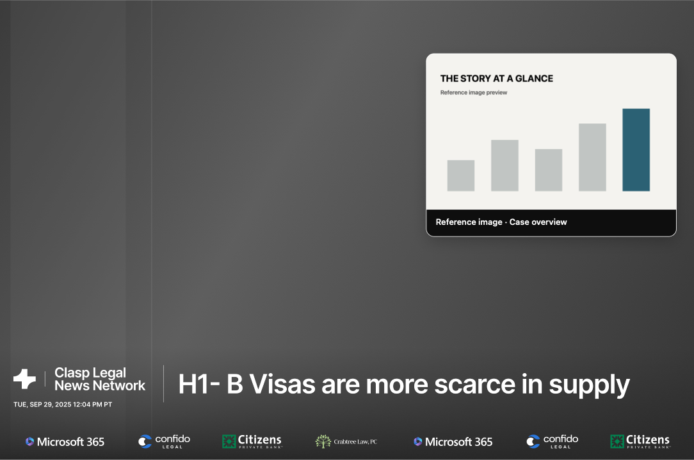

Choose **Reference image** below the studio preview, or from the recording-focus header. Add a PNG, JPEG, HEIC or TIFF, then use **On air** to show or hide it. The framed card keeps the entire image visible above the lower third, with a left/right position, adjustable size and optional caption.

Image changes made during recording become editable timeline boundaries. After recording, select a shot and open **Picture → Reference image** to add, replace, caption, resize or hide its card. Split at the desired time to change a card’s appearance or disappearance. References remain editable and are included in the preview and export; the original camera recording stays clean.

The imported design inspector controls artwork opacity, photo replacement, removal of solid canvas fills, and the camera opening’s position, size and corner radius. **Cut opening out of artwork** creates a camera window in an opaque design. Use **Replace SVG…** to bring in a revised file while keeping the library entry. SVG lettering converted to paths stays in the artwork and must be changed in your SVG authoring app. Imported SVGs are rendered once and cached; the camera preview and export use native Core Image layers. External links and scripts are not loaded.

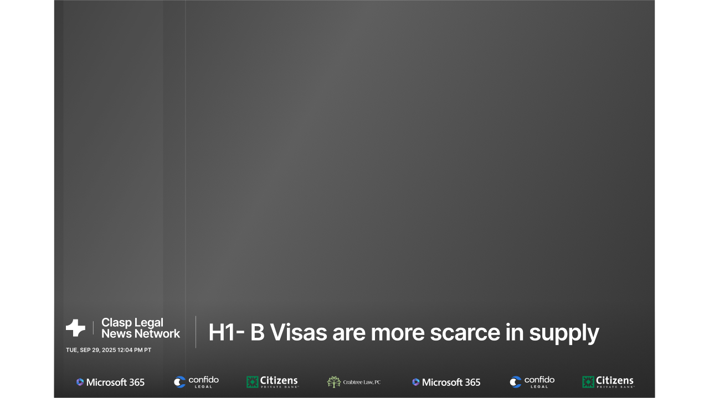

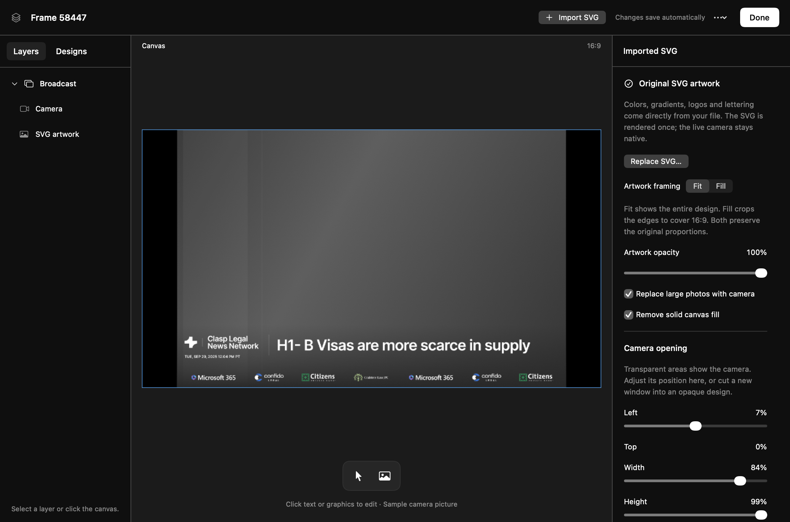

## Six designs, one library

<table>
  <tr><th>Law · Classic</th><th>AI · Editorial</th><th>AI · Blue</th></tr>
  <tr>
    <td>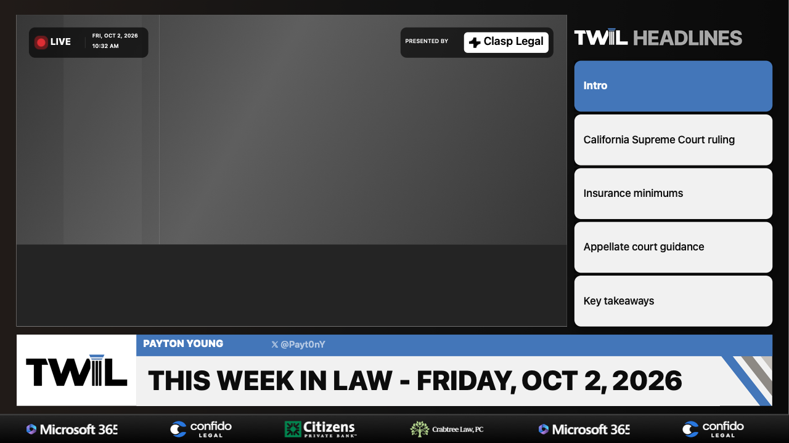</td>
    <td>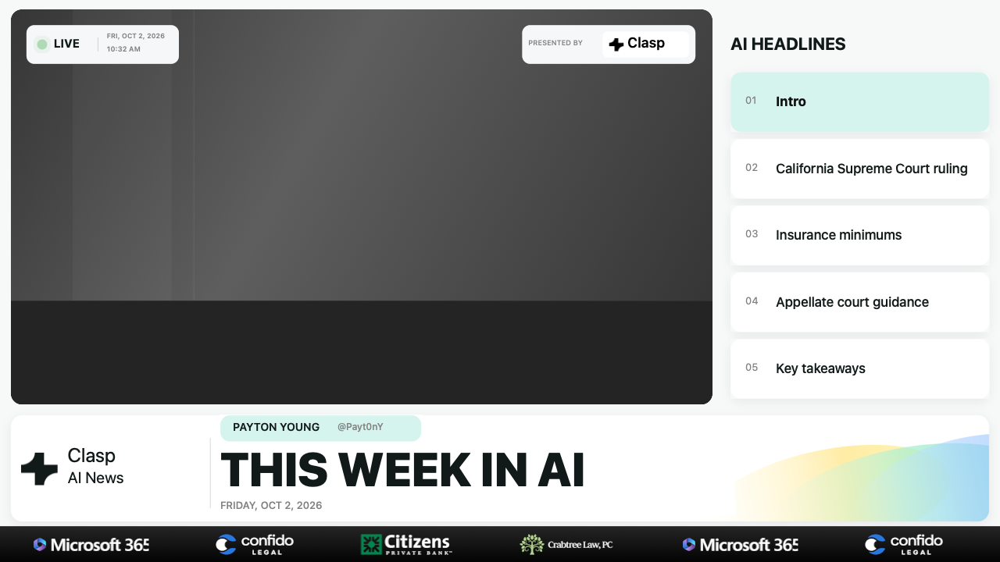</td>
    <td>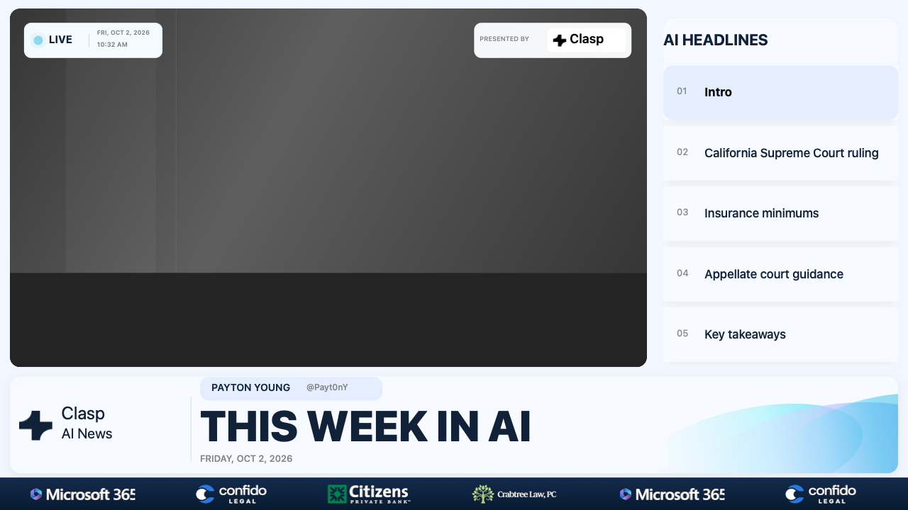</td>
  </tr>
</table>

The library also includes **AI · Graphite**, based on the gray and black broadcast design.

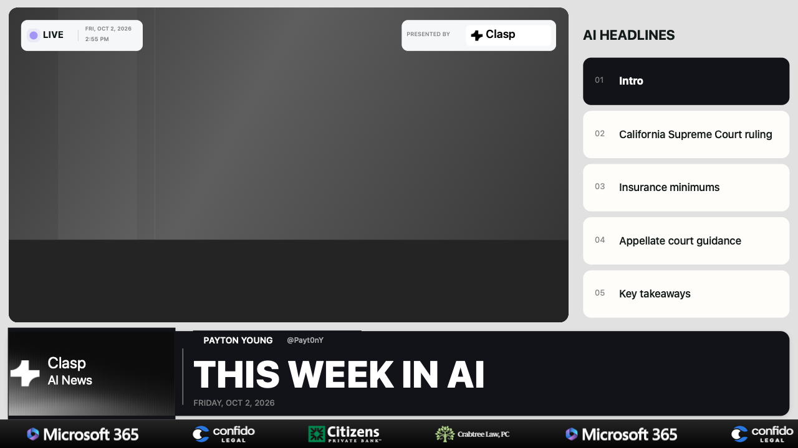

Its textured brand tile, dark lower third and purple LIVE indicator are native components; the supplied photograph is replaced by the live camera.

**Law · Glass** adds the new full-frame camera design with floating frosted panels with real, masked backdrop blur, a lower third and a monochrome sponsor strip. Its flattened reference is reconstructed as editable native components; the reference photograph is never included.

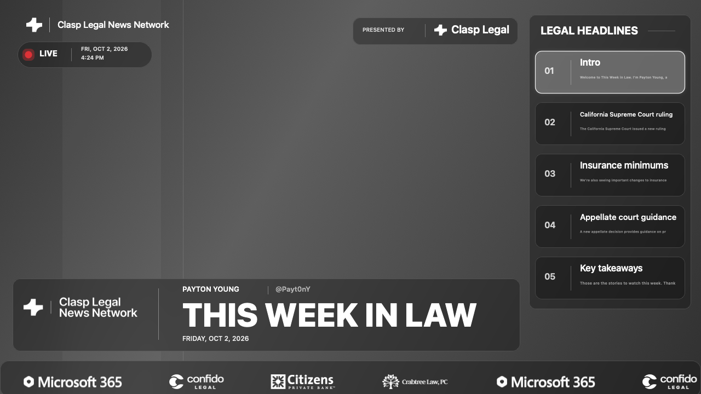

**Law · Ticker** preserves the new SVG’s outlined Clasp Legal News Network brand and gradient. One headline sits beside the brand and scrolls upward when the script changes sections. There is no sidebar.

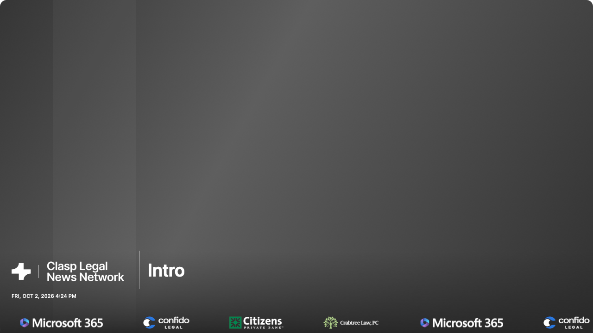

<details><summary>Watch the headline change</summary>

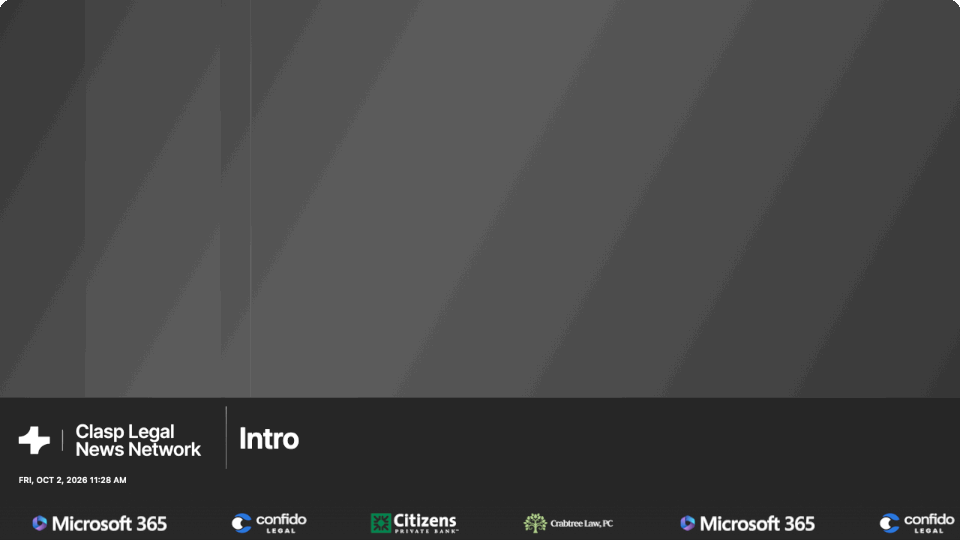

</details>

Open **Overlays**, then click a region on the canvas or choose it in **Layers**. Choose another template in **Designs**. The inspector edits the selected region’s text, visibility, logos or typography. Camera openings, text boundaries and logo proportions are protected. LIVE and presented-by badges can switch sides without colliding. Headlines follow your script sections.

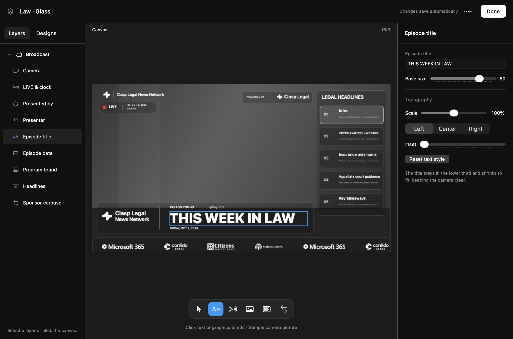

The selected layer opens its controls in the right inspector. The top menu provides episode details and branding; **Sponsors** opens compact logo and name controls. Each design keeps its own title, date, visibility, branding and component settings. Sponsor edits are shared across the library.

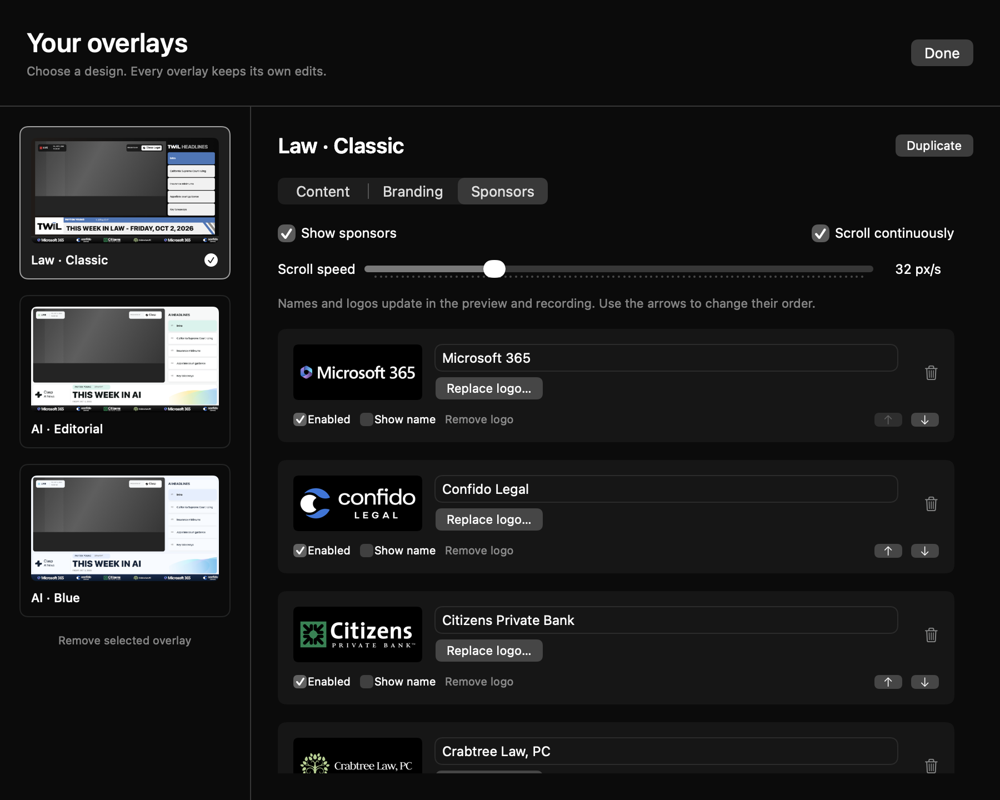

<details>
<summary><strong>See the sponsor carousel and LIVE pulse</strong></summary>

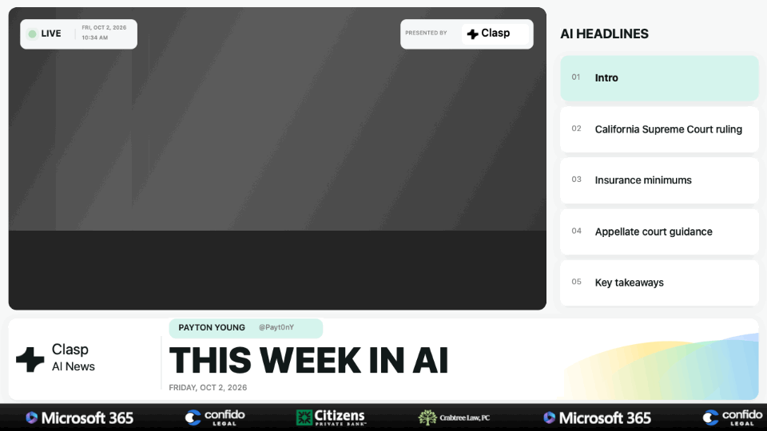

</details>

## Install

1. Download **Clasp-Studio.dmg** from the [latest release](https://github.com/deanayoung3-droid/clasp-studio/releases/latest).
2. Open the DMG and drag **Clasp Studio** into **Applications**.
3. Open the app from Applications and allow camera/microphone access when requested.

The app is **ad-hoc signed and not notarized**. If macOS blocks its first launch, use the system’s **Open Anyway** control in **System Settings → Privacy & Security** for this trusted build.

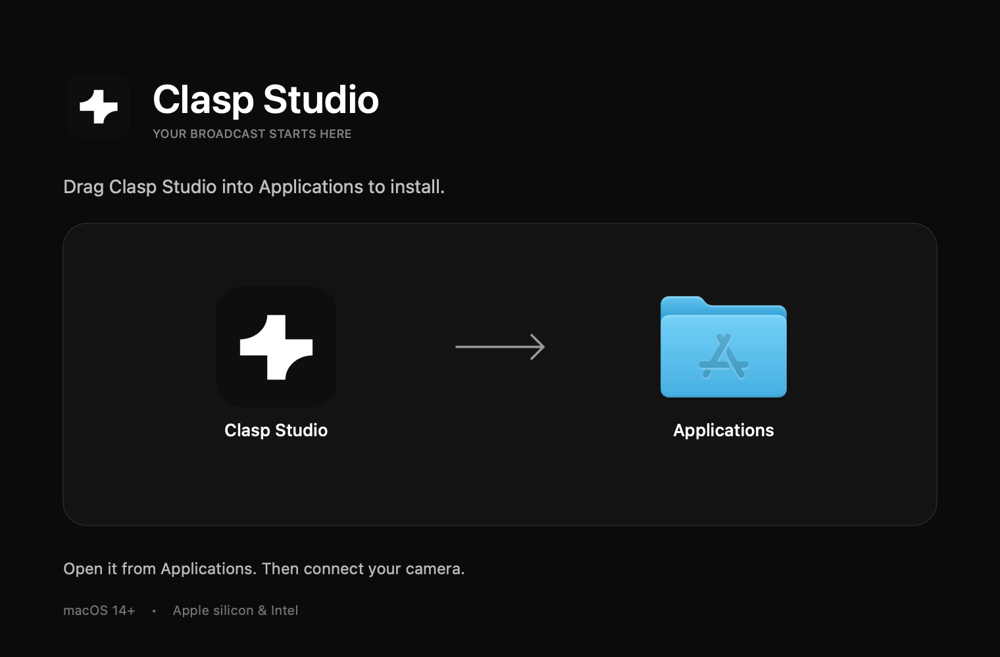

## Your first recording

1. Select your camera and microphone below the preview, then connect.
2. Choose **Import script** for TXT, Markdown, RTF, DOCX or a text-readable PDF, or **Edit / paste** to write directly. Markdown headings or blank paragraphs separate sections.
3. Choose a design in **Overlays** and edit its title, date, branding and sponsors.
4. Choose **Follow my voice** or **Reading pace**, then press **Start recording**.
5. Press **Stop recording** to open the broadcast editor. Click the video clip to place the playhead. Split, drag clip edges to trim, remove unwanted pieces, and drag clips to reorder them.
6. Select a clip to change its picture layout, graphics, active headline, source audio or transition.
7. Choose **Export**. When export finishes, choose **Show in Finder** to reveal and select your movie.

Final exports default to `~/Movies/Clasp Studio`. Change the folder in **Studio settings**. Drafts and original media save separately in Application Support; **Drafts** reopens them. Your script and app controls remain outside the exported video.

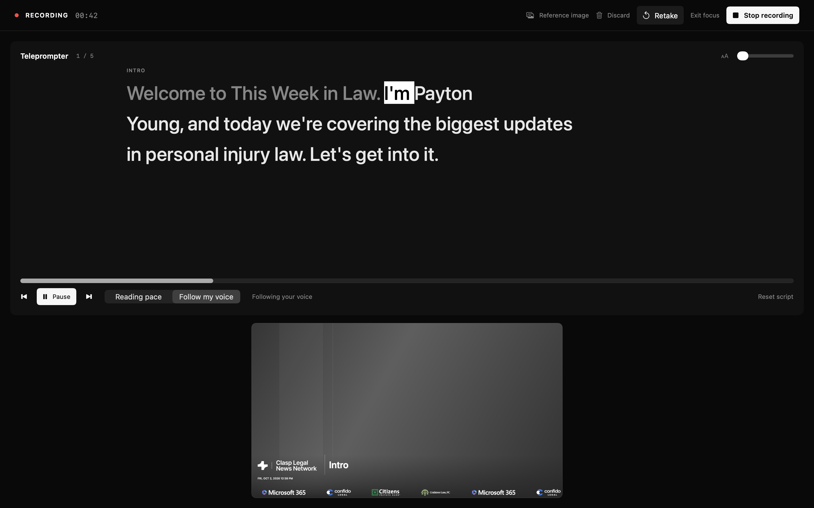


Voice following matches recognized English words to the script and pauses during silence or off-script speech. It requires microphone and Speech Recognition permission. **Reading pace** remains available when recognition cannot run on the selected setup. Apple backgrounds and effects require supported macOS/hardware; background replacement requires macOS 15 or newer.

## Edit any recording

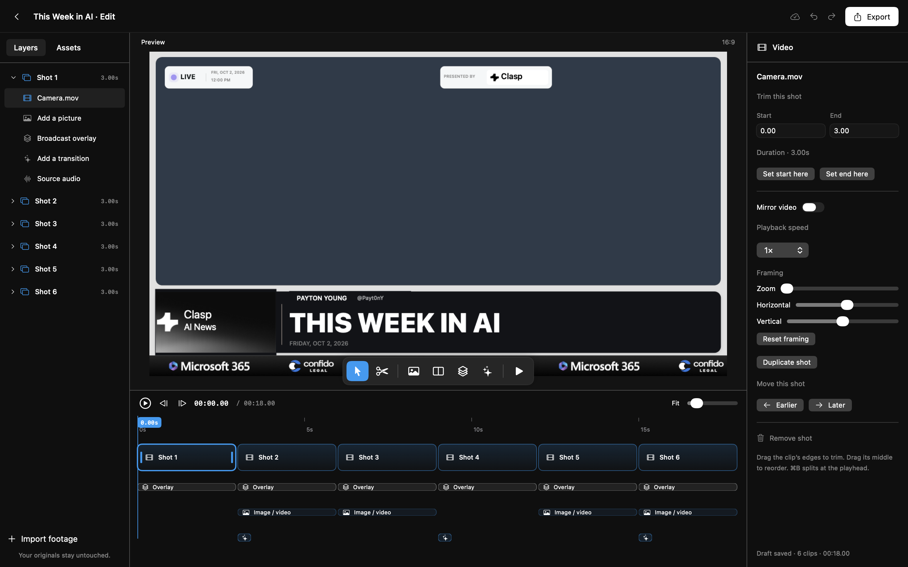

Choose **Import video** in the studio to open one or more MOV/MP4 videos, including recordings from Zoom. Imported files are copied into a local draft; originals are left untouched. The editor supports ordinary video and audio timelines, 16:9 broadcast output, portrait video rotation, and silent footage.

The left **Layers** list groups video, picture, overlay, transition and audio under each shot. The floating canvas toolbar switches between those controls, and the right inspector shows only the selected layer. **Assets** holds imported media; click a video to append it or an image to use it as a picture. The blue timeline clips are video; thin labeled rows are the overlay, supporting picture and transition.

Each timeline clip can show the **Presenter**, a replacement **Image / video**, or a **Split screen** with a supporting image or guest video. Turn **Show topics sidebar** off for a wider picture, or turn **Show overlay** off for a clean full-frame view. Supporting images fit without cropping by default; **Fill and crop** switches to a cover crop. Short supporting videos loop to fill their selected clip. **Use supporting audio** mixes the second video’s sound with the original source.

For a speaker change, split at the cut and select the incoming clip. Choose **News wipe**, **Fade through black**, or **Library animation**. The animation library supports multiple-file import, renaming and removal. Transparent ProRes MOVs composite over the program; opaque videos cover it. Animation audio mixes automatically and ducks presenter audio while the stinger plays. Animation files used in a draft are independent copies, so removing a library item does not break existing edits.

Frame stepping, shot duplication, 0.25×–4× speed, zoom and crop positioning are available in the Video inspector. Picture controls add adjustable split positions, swapped sides and picture-in-picture. Animation controls set source in point, timeline offset, duration, opacity and volume; the animation’s timeline bar shows its actual length and can be dragged to move it within the shot. **Clasp reveal** is the built-in branded panel transition.

 Scrubbing displays a composed still while paused.

Drafts autosave. Undo/redo keeps up to fifty edit states. Export and cancel operate on a temporary movie; the original media and draft remain intact. Graphics already burned into an imported video remain part of that source picture.

## Updates from GitHub

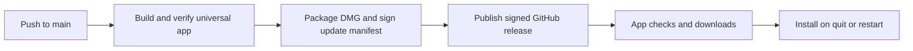
```mermaid
flowchart LR
  A[Push to main] --> B[Build and verify universal app]
  B --> C[Package DMG and sign update manifest]
  C --> D[Publish signed GitHub release]
  D --> E[App checks and downloads]
  E --> F[Install on quit or restart]
```

The release workflow runs on pushes to `main` and can also be run manually from **Actions**. Each release has an increasing build number, a ZIP update, a styled DMG, and an Ed25519-signed manifest. The app checks on launch and hourly when automatic updates are enabled. It validates the release signature, ZIP checksum, app identity, build number and code signature before preparing an update.

Downloaded updates install when you quit, or through **Studio settings → GitHub updates → Install and restart**. The app protects active recording and export from interruption. Installation keeps a previous copy until the new app passes verification and restores it if replacement fails.

Public releases download without a GitHub account, token or GitHub CLI. Automatic checks are enabled by default. If a newer release arrives while an update is already prepared, the app replaces the prepared update with the newer verified build. If the repository becomes private, the optional **GitHub access…** controls and signed-in GitHub CLI remain available.

Versions before 2.0.4 assumed private repository access. Those installations need one update to 2.0.4 or later: their existing updater works if GitHub access is connected, or users can install the latest DMG once. Versions without an updater also require that one-time installation. Afterwards, future signed releases download automatically and install on quit. Turning off automatic updates is respected.

The workflow’s `CLASP_UPDATE_SIGNING_KEY` secret is configured in this repository. Its corresponding public key is bundled with the app. Keep that signing key stable so already installed apps can verify future releases. The private signing key is never committed.

## Build from source

Requirements: macOS, Xcode with its command-line tools, and Python 3 for DMG packaging.

```sh
git clone https://github.com/deanayoung3-droid/clasp-studio.git
cd clasp-studio
./build.sh --universal
```

The build produces `../Clasp Studio.app` and `../Clasp Studio Preview App.zip`. The executable contains both `arm64` and `x86_64`; it targets macOS 14 or newer. Xcode compiles the native icon catalog, and the build verifies the staged ad-hoc signature before exporting the app.

```sh
python3 -m pip install --target .packaging-python -r Packaging/requirements.txt
PACKAGING_PYTHONPATH="$PWD/.packaging-python" ./package-dmg.sh
```

To verify script import, speech matching, overlay composition, animation, real video/audio encoding, recording transitions, saved-file notification, update signatures, and Metal orientation:

```sh
'../Clasp Studio.app/Contents/MacOS/ClaspStudio' \
  --self-test --test-output "$PWD/check.mov"
```

Preview commands render the native UI with the bundled sample script:

```sh
'../Clasp Studio.app/Contents/MacOS/ClaspStudio' --render-preview "$PWD/studio.png" --template AI --voice-preview
'../Clasp Studio.app/Contents/MacOS/ClaspStudio' --render-preview "$PWD/sponsors.png" --editor-preview --sponsors-preview
'../Clasp Studio.app/Contents/MacOS/ClaspStudio' --render-motion "$PWD/carousel.gif" --template AI
```

## Under the hood

SwiftUI and AppKit handle the interface. AVFoundation captures the selected camera/microphone and writes the movie. Core Image and Metal compose the camera, cached artwork, animated carousel and LIVE pulse. Apple Speech provides on-device recognition; script matching handles partial revisions, brief skips and repeated phrases.

Graphics rasterize when settings change. Frames reuse cached textures and only adjust camera fitting, carousel translation and pulse opacity. The preview keeps one latest frame and at most one GPU presentation in flight. Speech audio runs independently of video encoding, with bounded queues and cached script tokens.

## Local data

- Project: `~/Library/Application Support/ClaspStudio/project.json`
- Drafts and source media: `~/Library/Application Support/ClaspStudio/Drafts`
- Animation library: `~/Library/Application Support/ClaspStudio/Animations`
- Final exports: `~/Movies/Clasp Studio`, or your selected folder
- GitHub access: macOS Keychain
- Prepared updates: `~/Library/Caches/com.clasp.studio/updates`

The source backup includes app code, design assets, installer artwork and sample previews. Sponsor artwork belongs to its respective owners; bundled designs and brand assets are provided for this project.
